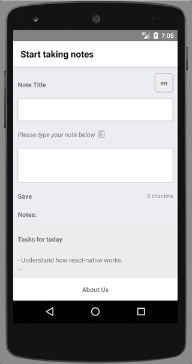

# exit-on-double-back

A react-native module to exit an app when the back button is pressed twice on android device.

Note: This module is only works with [react-navigation](https://reactnavigation.org/)(as of now) and your navigator should be [integrated to redux store](https://reactnavigation.org/docs/guides/redux).

## Why do I need this module?

If you need to perform some action on your app when the back button is pressed twice on the landing screen of the application, this module is for you.

## Props

This module accepts the following props:

| Prop   |Explanation| Default Value      |Type |
|----------|:------------------:|:--------------|
|`toastMessage`|Message to be displayed on the toast when the back button is pressed on the landing screen.|'Press back again to exit the app'|string
|`doubleBackInterval`|Interval(in ms) in which JS will wait for second back press|3000|number|
|`exitableRoutes`|Route names where toast message will be shown on first back press|['Landing']|Array||
|`onDoubleBack`|Function to be called on double back press in the passed interval. If no function is passed, the app will exit.|`BackHandler.exitApp`|Function||
|`backHandler`|Function to be called on normal back presses of the application. |noop|Function|
|`nav`|Your router state from the redux store(will be used to get current route name)|{}|Object|

## Demo

<div style="text-align:center">
  
</div>

## Usage

After integration react-navigation with redux store, your App would look something like this:
```js
class App extends React.Component {
  render() {
    const {dispatch, nav} = this.props;
    return (
      <AppNavigator navigation={addNavigationHelpers({dispatch, state: nav})} />
    );
  }
}
const mapStateToProps = (state) => ({
  nav: state.nav
});
```

To use this component, just wrap this component around `ExitOnDoubleBack` and pass the required props.

```js
import ExitOnDoubleBack from 'exit-on-double-back';

class App extends React.Component {
  render() {
    const {dispatch, nav, goBack} = this.props;
    return (
      <ExitOnDoubleBack exitableRoutes={['home']} nav={nav} backHandler={goBack}>
        <AppNavigator navigation={addNavigationHelpers({dispatch, state: nav})} />
      </ExitOnDoubleBack>
    );
  }
}
const mapStateToProps = (state) => ({
  nav: state.nav
});
const mapDispatchToProps = (dispatch) => ({
  goBack: () => this.props.dispatch(NavigationActions.back())
})
```
If you wish to override the default behavior of exiting the app or add your own message/interval, you can pass additional props.

```js
<ExitOnDoubleBack interval={2000} toastMessage='Please don\'t go'  exitableRoutes={['home']} nav={nav} backHandler={goBack}>
  <AppNavigator navigation={addNavigationHelpers({dispatch, state: nav})} />
</ExitOnDoubleBack>
```

That's all, your app now supports double back press to exit feature.

<div style="text-align:center">
  
</div>


>Note: I have used JS `setTimeout` instead of [Timers](https://facebook.github.io/react-native/docs/timers.html). The Timer module is a react mixin and react team is [discouraging](https://github.com/brigand/react-mixin) the use of mixins in favour of higher order components. I am handling clearing the timeout as well whenever the action is done or the component unmounts.
